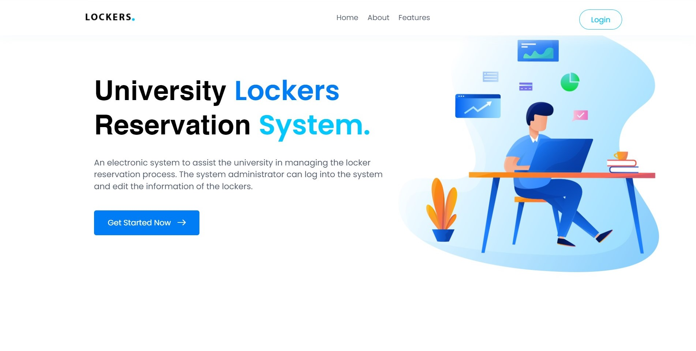
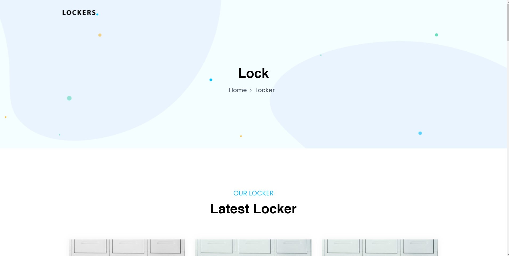
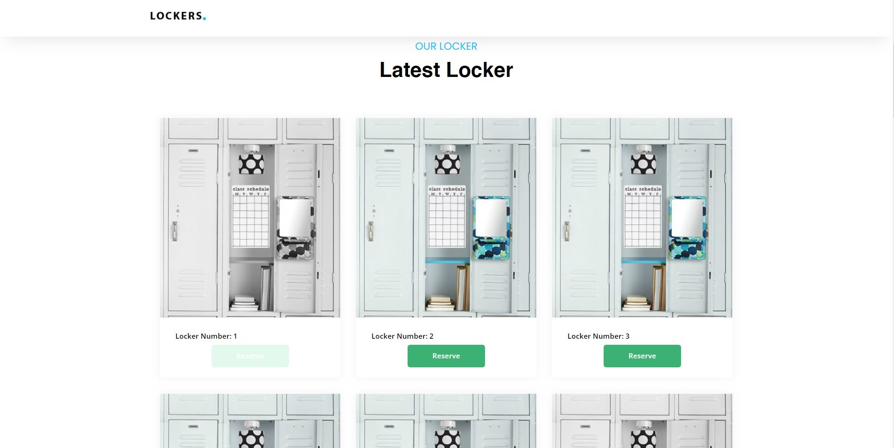
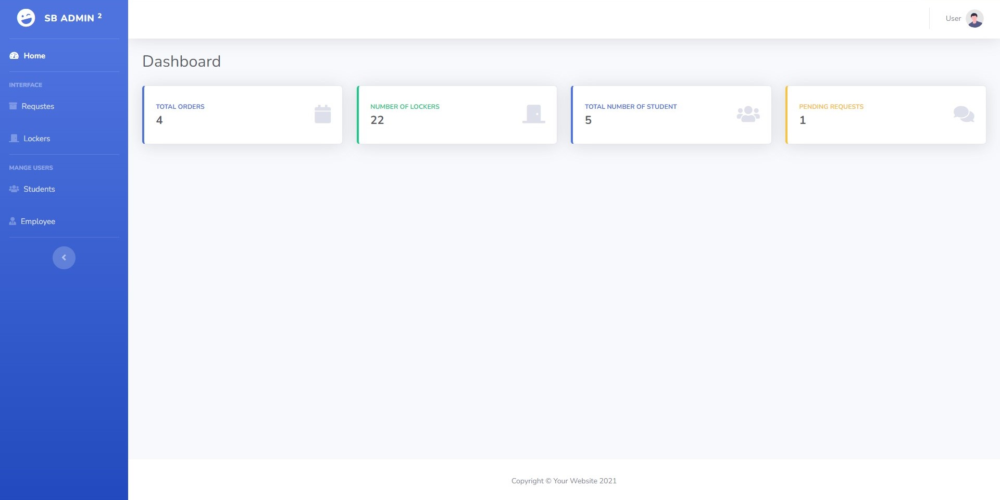
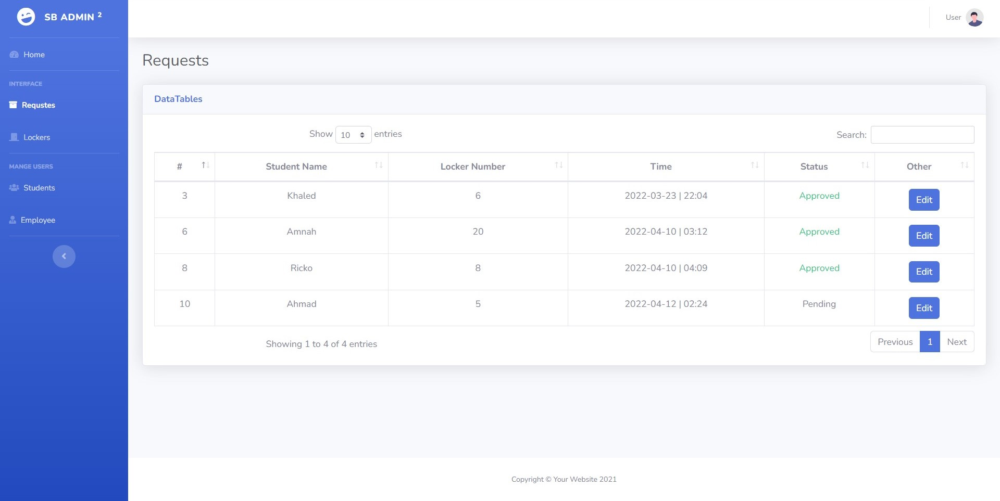

# Lockers Reservation System.

[![LinkedIn][linkedin-shield]][linkedin-url]
[![Twitter][twitter-shield]][twittwe-url]
[![Twitter][github-shield]][github-url]


  <h3 align="center">Lockers Reservation System</h3>

  <p align="center">
    An electronic system to assist the university in managing the locker reservation process. 
  </p>





<!-- ABOUT THE PROJECT -->
## About The Project

<b>This project focuses to solve failure to use lockers with high efficiency, and Inability of administrators to know and control reservations</b>
<Br>

# Deploy Application with Docker 🐬
### 1. Clone the repo

Before clone project make sure you already have docker and docker-compose.
<br>Clone the `Locker_System` locally:

``` shell script
git clone https://github.com/Ahmad-Faqehi/Locker_System.git
cd Locker_System
```

### 2. Run docker-compose file
Note: Make sure the ports <b>3306, 8080, 8100</b> are available on your system.
``` shell script
docker-compose up -d
```
### 3. Access the application

You can access the application from the browser by the following:<br>
http://localhost:8000

To assess phpmyadmin you can use the following:<br>
http://localhost:8088
the login info for mysql is:
```shell
Username: ahmad
Password: password
```
You can use this credential to access phpmyadmin.


<!-- USAGE EXAMPLES -->
## Screenshots


* []() Home Page <br>


* []() Locker's Page <br>




* []() Admin Dashboard <br>


* []() Request Info on Dashboard <br>



<!-- CONTACT -->
## Contact Me

Ahmad Faqehi - [iAhmad.info](https://iAhmad.info) - alfaqehi775@hotmail.com

Project Link: [https://github.com/Ahmad-Faqehi/Locker_System](https://github.com/Ahmad-Faqehi/Locker_System)


<!-- MARKDOWN LINKS & IMAGES -->
<!-- https://www.markdownguide.org/basic-syntax/#reference-style-links -->
[linkedin-shield]: https://img.shields.io/badge/-LinkedIn-black.svg?style=for-the-badge&logo=linkedin&colorB=555
[linkedin-url]: https://linkedin.com/in/ahmad-faqehi
[twitter-shield]: https://img.shields.io/badge/-twitter-black.svg?style=for-the-badge&logo=twitter&colorB=555
[twittwe-url]: https://twitter.com/A_F775
[github-shield]: https://img.shields.io/badge/-github-black.svg?style=for-the-badge&logo=github&colorB=555
[github-url]: https://github.com/Ahmad-Faqehi